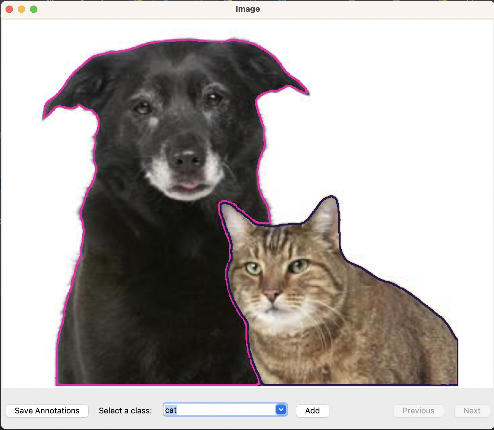
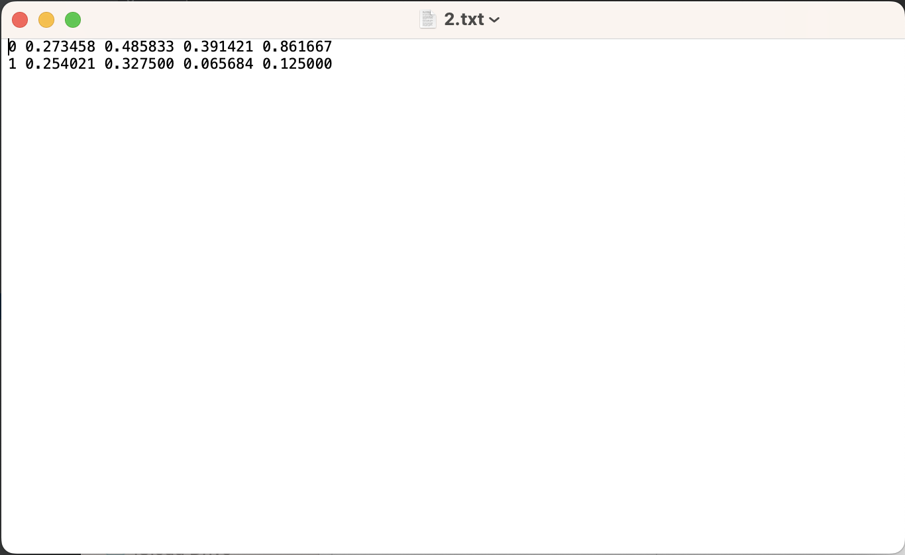

# SAM-notator
An entry-level approach to build an annotator tool (YOLO format) that speeds up the process of selecting objects of interest using SAM
The output will be txt files containing the bounding boxes of each object.

### A - Demo

### B - Installation

##### 1. Create virtual environment 
    conda create --name Samnotator python=3.10
    conda activate Samnotator

##### 2. Clone the SAM-notator repository from GitHub

    git clone https://github.com/tsdinh442/SAM-notator

##### 3. Download dependencies 
    
    pip install opencv-python pycocotools matplotlib onnxruntime onnx

or

    conda install opencv-python pycocotools matplotlib onnxruntime onnx

##### 4. Install Pytorch
Follow the instructions on this [link](https://pytorch.org)  to install Pytorch 

##### 5. Install segment-anything
Follow the instructions in the [Segment-Anything](https://github.com/facebookresearch/segment-anything) GitHub repository

    https://github.com/facebookresearch/segment-anything

##### 6. Download model checkpoint
According to the [Segment-Anything](https://github.com/facebookresearch/segment-anything) GitHub repository, there are 3 model checkpoints.

In this repo, I used the `default` (or `vit_h`) model: [ViT-H SAM model](https://dl.fbaipublicfiles.com/segment_anything/sam_vit_h_4b8939.pth)

Other models are available in the GitHub repo [Segment-Anything](https://github.com/facebookresearch/segment-anything`). Check out the link to learn more.

### C - Getting started 

##### 1. Create a directory call `models'

    cd <path/to/SAM-notator>
    mkdir models

##### 2. Place the model checkpoint to the newly-created 'models' directory 
    
    cp <path/to/the/downloaded/model/checkpoint> models

##### 3. Move the model to GPU
If _not_ using MacOS, in `sam.py `, comment out 

    # device = 'mps' if torch.backends.mps.is_available() else 'cpu'

and uncomment 

    device = 'cuda' if torch.cuda.is_available() else 'cpu'
    
##### 4. Replace model model checkpoint
If _not_ using the `default` or `vit-h` model check point, in `sam.py`, replace the value of `model_chekpoint` with the path to your chosen check point and replace the value of `model_type` with the according model type

    check_point = '<path/to/checkpoint>'
    model_type = <model_type>

##### 5. Run the app

    python samnotator/main.py

### Acknowlegedment
`
SAM-notator is based on Segment-Anything, https://github.com/facebookresearch/segment-anything, which is licensed under the Apache License, Version 2.0.
See the LICENSE file for the full license text.
`