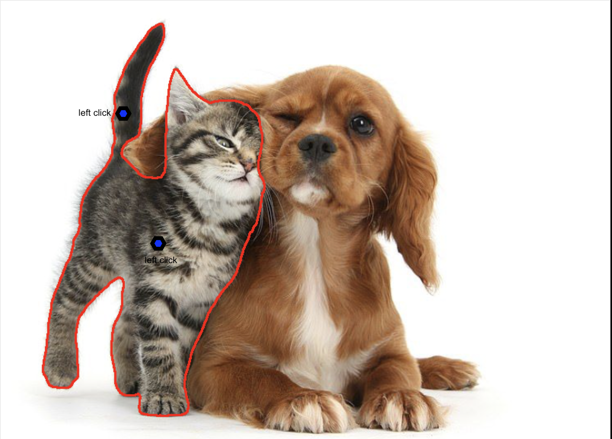
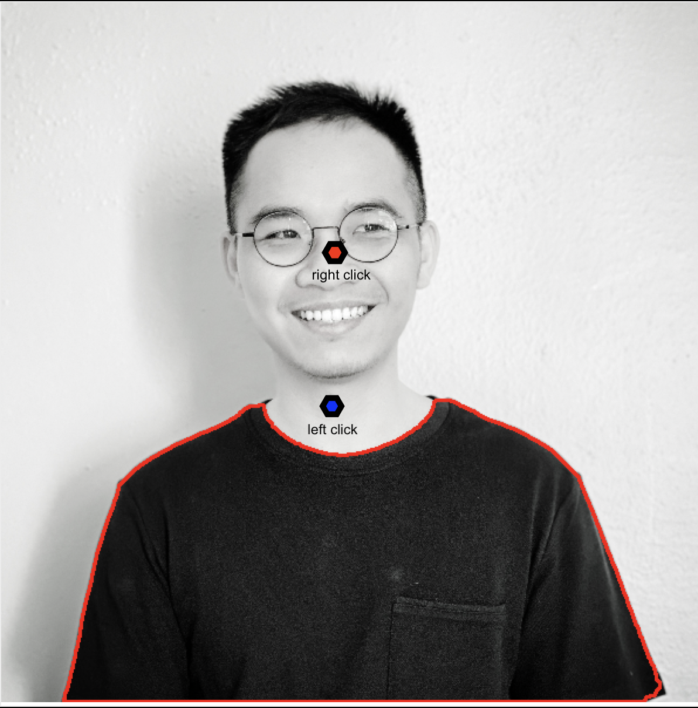

# SAM-notator
An annotator tool that speeds up the process of selecting objects of interest using [**SAM**](https://github.com/facebookresearch/segment-anything) or [**Segment-Anything**](https://github.com/facebookresearch/segment-anything).
The output will be txt files containing the **_bounding boxes_** information of each object in `YOLO` format.

 

### A - Demo

Watch the Demo [here](https://www.youtube.com/watch?v=9W1M8kxq8ms).

### B - Installation

##### 1. Create virtual environment 
    conda create --name Samnotator python=3.10
    conda activate Samnotator

##### 2. Clone the SAM-notator repository from GitHub

    git clone https://github.com/tsdinh442/SAM-notator

##### 3. Download dependencies 
    
    pip install opencv-python pycocotools matplotlib onnxruntime onnx

or

    conda install opencv-python pycocotools matplotlib onnxruntime onnx

##### 4. Install Pytorch and TorchVision
Follow the instructions on this [link](https://pytorch.org)  to install Pytorch and TorchVision dependencies.

##### 5. Install segment-anything
Follow the instructions in the [Segment-Anything](https://github.com/facebookresearch/segment-anything) GitHub repository

    https://github.com/facebookresearch/segment-anything

##### 6. Download model checkpoint
According to the [Segment-Anything](https://github.com/facebookresearch/segment-anything) GitHub repository, there are 3 model checkpoints.

In this repo, I used the `default` (or `vit_h`) model: [ViT-H SAM model](https://dl.fbaipublicfiles.com/segment_anything/sam_vit_h_4b8939.pth)

Other models are available in the GitHub repo [Segment-Anything](https://github.com/facebookresearch/segment-anything`). Check out the link to learn more.

### C - Getting started 

##### 1. Create a directory call `models'

    cd <path/to/SAM-notator>
    mkdir models

##### 2. Place the model checkpoint to the newly-created 'models' directory 
    
    cp <path/to/the/downloaded/model/checkpoint> models

##### 3. Move the model to GPU
If _not_ using MacOS, in `sam.py `, comment out 

    # device = 'mps' if torch.backends.mps.is_available() else 'cpu'

and uncomment 

    device = 'cuda' if torch.cuda.is_available() else 'cpu'
    
##### 4. Replace model model checkpoint
If _not_ using the `default` or `vit-h` model check point, in `sam.py`, replace the value of `model_chekpoint` with the path to your chosen check point and replace the value of `model_type` with the according model type

    check_point = '<path/to/checkpoint>'
    model_type = <model_type>

##### 5. Run the app

    python samnotator/main.py

### D - How to use

##### 1. Select an object
To *select* an object, `left click` the object. Continue to left click other parts of the object until the whole object is selected.

 

##### 2. Deselect part of an object
To *deselect* part of an object `right click` on the part to be removed. 

 

#### 3. Add a bounding box
After the object is selected, from the dropdown, choose the according class and click `Add`. 

**Watch the [Demo](https://www.youtube.com/watch?v=9W1M8kxq8ms) for more details.**

###### Acknowlegedment

    SAM-notator is based on Segment-Anything, https://github.com/facebookresearch/segment-anything, which is licensed under the Apache License, Version 2.0.
    See the LICENSE file for the full license text.
